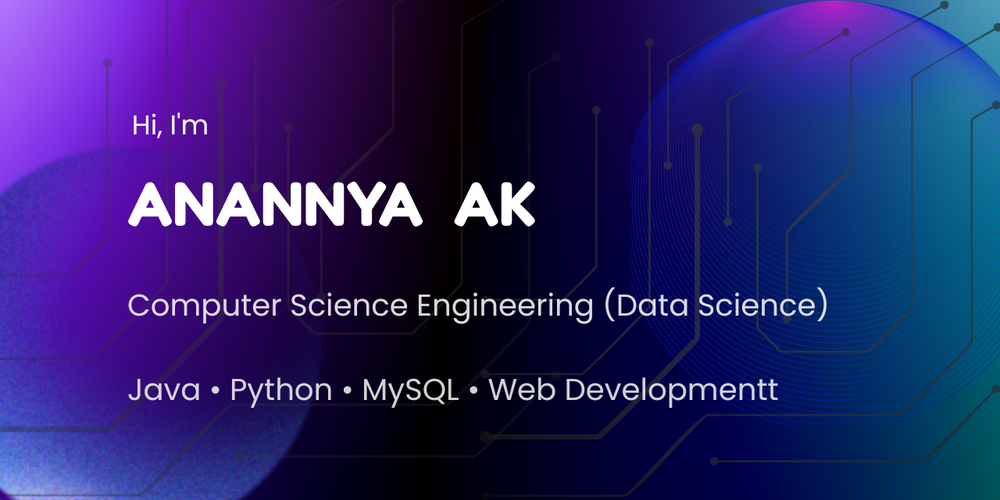

  

<h1 align="center">Hi 👋, I'm Anannya AK</h1>

  

  

---

# 💫 About Me

🎓 B.Tech Computer Science and Engineering (Data Science)

🏫 St. Thomas College of Engineering & Technology

💻 Interested in Software Development, Web Development and Data Science

🌱 Currently improving my Java, Python, SQL and Web Development skills

🚀 I enjoy building projects that help me learn new technologies.

📍 Kerala, India

---

# 🛠 Tech Stack

---

# 📚 Currently Learning

- Java Development
- Python Programming
- SQL
- Web Development
- Data Science Fundamentals

---

# 🚀 Featured Projects

### 🏨 Hotel Room Booking System

Java Swing + MySQL desktop application featuring room booking, payments, reviews and management system.

🔗 https://github.com/Anannyaa97/Hotel-Room-Booking-System

---

### 💻 IEEE Website

Responsive website developed using HTML and CSS.

🔗 https://github.com/Anannyaa97/IEEE-WEBSITE

---

### ⚙ Unified vs Split Cache (RISC-V)

Performance comparison of Unified Cache and Split Cache architectures using Ripes Simulator.

🔗 https://github.com/Anannyaa97/Unified-vs-Split-Cache-RISC-V

---

# 📊 GitHub Stats

---

# 🔥 GitHub Streak

---

# 🏆 GitHub Trophies

---

# 📈 Contribution Graph

---

# 🤝 Connect with Me

---

✨ Thanks for visiting my profile! ✨

